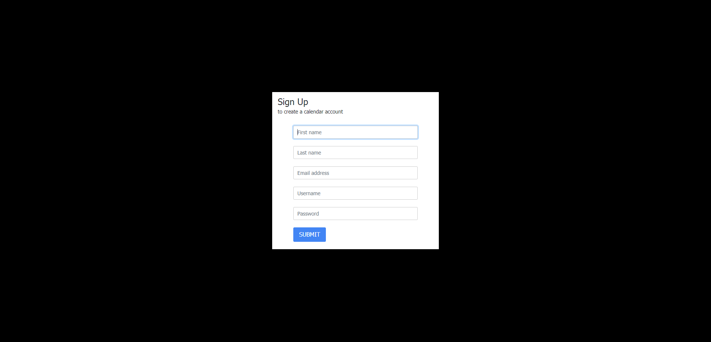
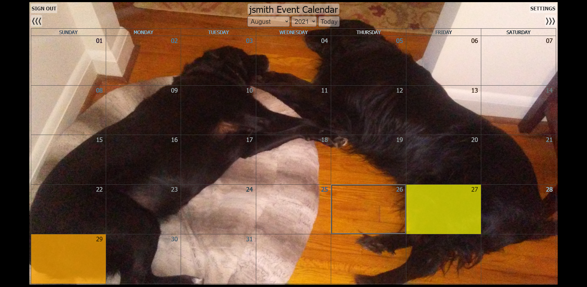
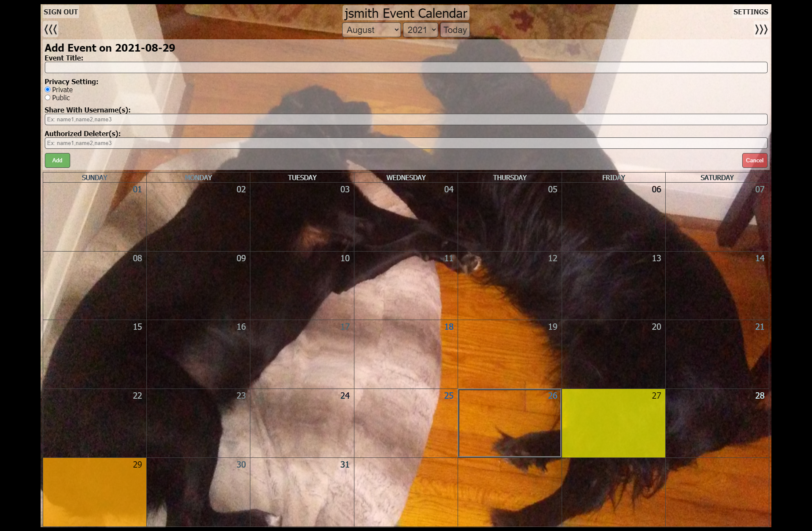
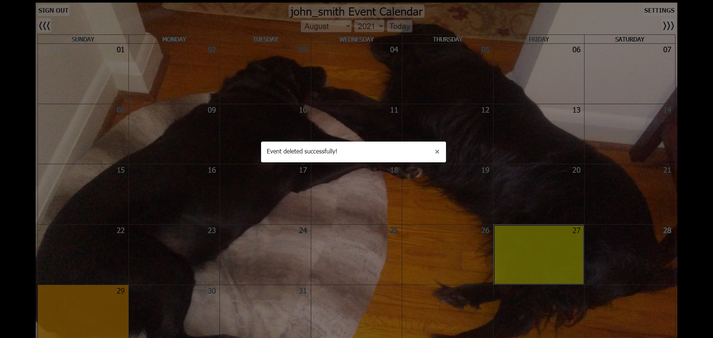
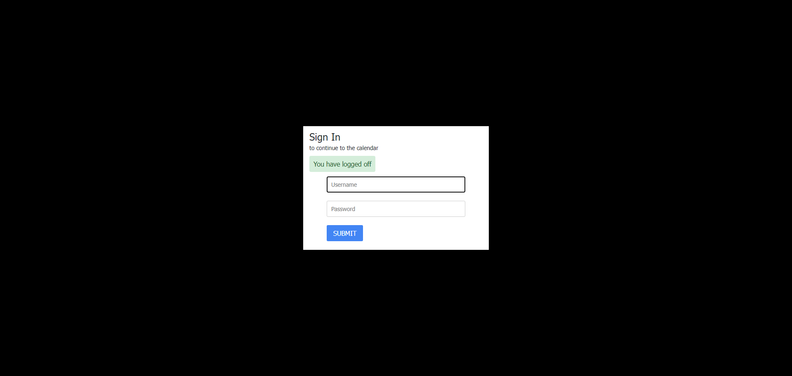

# PHP and JavaScript Event Calendar

## Description
This code is for an event calendar. It was created using HTML, CSS, JavaScript, jQuery, Bootstrap, PHP, and MySQL.

## Functionality
It displays the current month, and has arrows to move to the previous or following months, along with dropdowns that let you select a month and year to display. It also has a "Today" button that returns you to the current month.

Hovering over a day block will present you with a popup that allows you to add a new event or view events for that day (if any exist).

When adding an event, you can enter the event title, select whether it is public or private, give other users the ability to view it by entering their usernames, and even give them the rights to delete the event if you wish. Private events can only be seen by you or other users that were given access. Public events can be seen by anyone, including unregistered users.

When viewing events, it shows you all of the above information, and also includes a "Delete" button if you are the event creator, or were granted delete rights for someone else's event. Unregistered users can only see the title of public events, and nothing more.

When not signed in, there's a sign in link in the upper left corner.

When signed in, there's a sign out link in the upper left corner. This will sign you out and end your session. There's also a settings link in the upper right corner. This link takes you to a settings page where you can change your name, email address, and/or password. You can also add background images to each month.

There's a 20 minute session timer that will log out users after 20 minutes of inactivity.

This is currently configured to show all future days with a green background, unless they have events. Days with 1 event are yellow, 2 events are orange, 3 events are red, 4 events are purple, and 5 or more events are blue. The current day is outlined. Past days have no background, but if there's un-deleted events left on them they flash yellow. This only applies when logged in. If you're logged out or unregistered, only days with public events have any color.

## Requirements
Since this calendar is PHP based, it will need to be hosted on a web server with PHP installed in order to function properly. It works on PHP version 7.4, and has not been tested with any other versions.

This calendar requires a database to function. The calendar.sql file contains the database schema, and can be used to assist in creating the database.

Once the database is created, the dbConfig.php file will need to have the hostname, username, and password updated.

There's a link to the sign up page on the sign in page, although it can be removed after you create your account if you don't want the general public creating accounts.

## Screenshots
This is what the calendar looks like when not logged in, and when there's no public events:

The sign up page:

The sign in page:

The calendar with events:

The calendar with a background picture:

The event popup:

The adding an event:

An event has been added:

Showing events:

An event has been deleted:

The settings page:

Logged off:

Timed out:

## Credits
The basic calendar code came from <https://www.codexworld.com/build-event-calendar-using-jquery-ajax-php/php-event-calendar-jquery-ajax-mysql-codexworld/>. That code consisted of displaying the calendar, and adding and viewing events. The functionality has been improved here to allow cancellation of new events in the "Add event" section before submitting them, setting event privacy to public or private, sharing private events with other users via their usernames, deletion of events by original submitter (and approved users) only, and visible holidays. There's also a new settings section where users can change their name, email address, and password, and add background images to each month.

## Disclaimer
I know that this code is not written in the most efficient way, and that there's tons of room to improve it. It's a work in progress, and has been tweaked and adjusted numerous times over the past year to add new functionality. It's messy, but it works. I'll eventually streamline the code to bring it up to industry standards.
