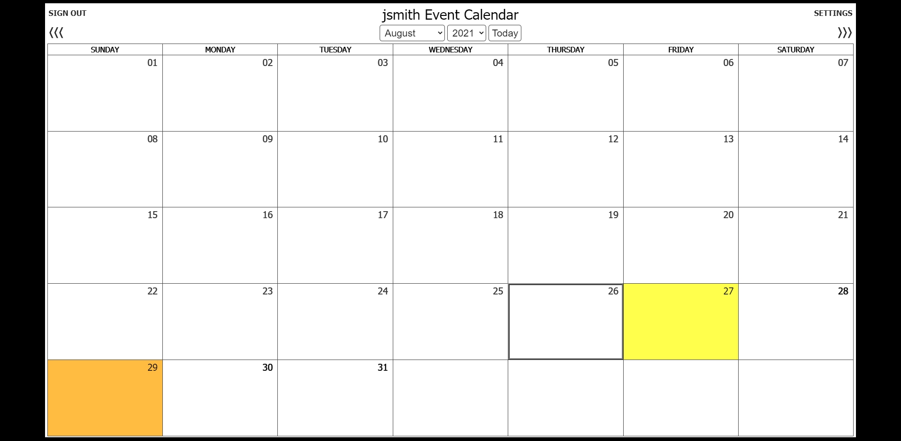
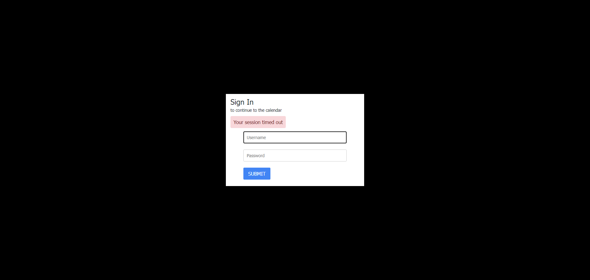

# PHP and JavaScript Event Calendar
[
](https://opensource.org/licenses/MIT)

## Description
This code is for an event calendar. It was created using HTML, CSS, JavaScript, jQuery, Bootstrap, PHP, and MySQL.

## Demo Deployment
A demo of this app has been deployed to Heroku. Any images uploaded as backgrounds for the months will not remain for long periods of time because the Heroku filesystem is ephemeral - that means that any changes to the filesystem whilst the dyno is running only last until that dyno is shut down or restarted. Each dyno boots with a clean copy of the filesystem from the most recent deploy. However, any background images you upload will be available during your testing session so that you can see how it works. I may eventually consider an S3 image hosting solution in the future so that the images are always available, but my priority at this time is to get a working demo up and running for short-term testing. The application can be found at https://php-javascript-event-calendar.herokuapp.com.

## Functionality
It displays the current month, and has arrows to move to the previous or following months, along with dropdowns that let you select a month and year to display. It also has a "Today" button that returns you to the current month.

Hovering over a day block will present you with a popup that allows you to add a new event or view events for that day (if any exist).

When adding an event, you can enter the event title and description, select whether it is public or private, give other users the ability to view it by entering their usernames, and even give them the rights to delete the event if you wish. Private events can only be seen by you or other users that were given access. Public events can be seen by any registered users.

There is a 50 character limit for titles, and a 250 character limit for descriptions. Each one has a character counter to keep track of how many characters you've used.

When viewing events, it shows you all of the above information, and also includes a "Delete" button if you are the event creator, or were granted delete rights for someone else's event. Unregistered users can only see the title of public events, and nothing more.

When not signed in, it defaults to the sign in page.

When signed in, there's a sign out link in the upper left corner. This will sign you out and end your session. There's also a settings link in the upper right corner. This link takes you to a settings page where you can change your name, email address, and/or password. You can also add background images to each month.

There's a 20 minute session timer that will log out users after 20 minutes of inactivity.

The days with events have a different background color. Days with 1 event are yellow, 2 events are orange, 3 events are red, 4 events are purple, and 5 events are blue, and 6 or more events are dark gray. The current day is outlined.

## Requirements
Since this calendar is PHP based, it will need to be hosted on a web server with PHP installed in order to function properly. It works on PHP version 7.4, and has not been tested with any other versions.

This calendar requires a database to function. The calendar.sql file contains the database schema, and can be used to assist in creating the database.

Once the database is created, the dbConfig.php file will need to have the hostname, username, and password updated.

In order for the background images to function properly, you will need to create a folder named ```images``` outside of, but at the same level as, your root folder. This folder is used to hold the uploaded images while they're sanitized, converted to .png, renamed, and copied into the images folder inside the root, and then the images are deleted from this folder.

There's a link to the sign up page on the sign in page, although it can be removed after you create your account if you don't want the general public creating accounts.

## Screenshots
When initially launched, you're taken to the sign in page. Any attempts to access the calendar while not logged in are redirected to this page:


The sign up page:


The calendar when logged in, and with events:


The calendar with a background picture:


The event popup:


Adding an event:


An event has been added:


Showing events:


An event has been deleted:


The settings page:


Logged off:


Timed out:


## Credits
The basic calendar code came from <https://www.codexworld.com/build-event-calendar-using-jquery-ajax-php/php-event-calendar-jquery-ajax-mysql-codexworld/>. That code consisted of displaying the calendar, and adding and viewing events. The functionality has been improved here to allow cancellation of new events in the "Add event" section before submitting them, adding a description of the event, setting event privacy to public or private, sharing private events with other users via their usernames, deletion of events by original submitter (and approved users) only, and visible holidays. There's also a new settings section where users can change their name, email address, and password, and add background images to each month.

## Disclaimer
I know that this code is not written in the most efficient way, and that there's tons of room to improve it. It's a work in progress, and has been tweaked and adjusted numerous times over the past year to add new functionality. It's messy, but it works. I'll eventually streamline the code to bring it up to industry standards.

## License
MIT

Copyright 2021 Todd Harvey

Permission is hereby granted, free of charge, to any person obtaining a copy of this software and associated documentation files (the "Software"), to deal in the Software without restriction, including without limitation the rights to use, copy, modify, merge, publish, distribute, sublicense, and/or sell copies of the Software, and to permit persons to whom the Software is furnished to do so, subject to the following conditions:

The above copyright notice and this permission notice shall be included in all copies or substantial portions of the Software.

THE SOFTWARE IS PROVIDED "AS IS", WITHOUT WARRANTY OF ANY KIND, EXPRESS OR IMPLIED, INCLUDING BUT NOT LIMITED TO THE WARRANTIES OF MERCHANTABILITY, FITNESS FOR A PARTICULAR PURPOSE AND NONINFRINGEMENT. IN NO EVENT SHALL THE AUTHORS OR COPYRIGHT HOLDERS BE LIABLE FOR ANY CLAIM, DAMAGES OR OTHER LIABILITY, WHETHER IN AN ACTION OF CONTRACT, TORT OR OTHERWISE, ARISING FROM, OUT OF OR IN CONNECTION WITH THE SOFTWARE OR THE USE OR OTHER DEALINGS IN THE SOFTWARE.